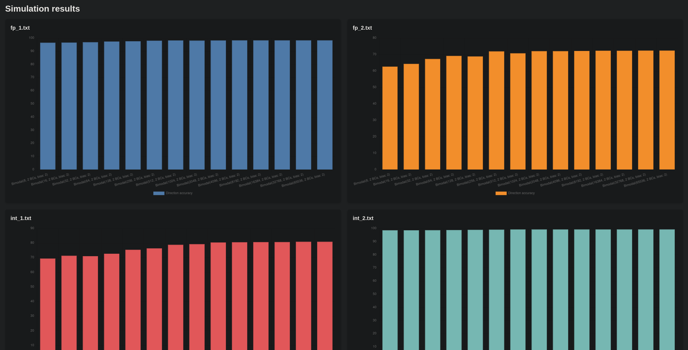

# Branch Predictor Simulator
#### A Java-based, trace-driven CPU branch predictor simulator.

This program can simulate any branch predictor (direction, target or both) under a variety of different conditions.

